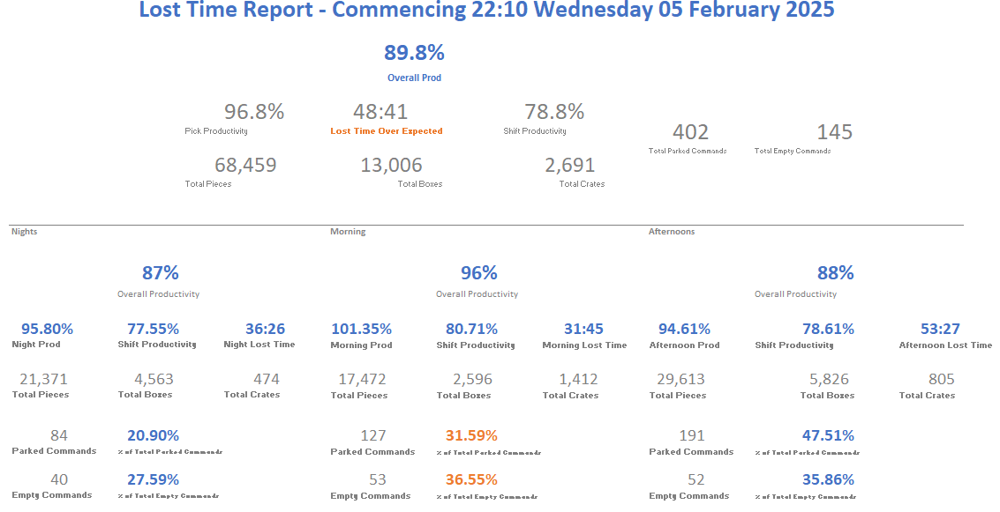
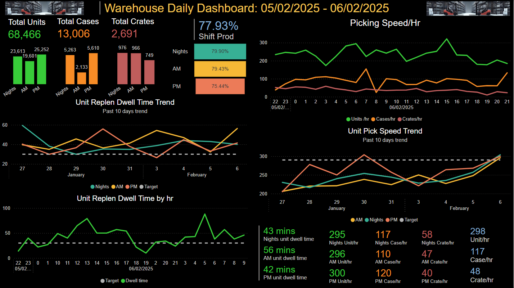

# 🚀 Warehouse Efficiency Improvement - Power BI Dashboard

## **📌 Project Overview**
This project transformed a **static Excel-based warehouse report** into a **dynamic Power BI dashboard**, significantly improving efficiency and real-time visibility.

### **⚡ Before vs After**
| Before (Excel Report) | After (Power BI Dashboard) |
|----------------------|------------------------|
|  |  |

---

## **📈 Key Features**
✅ Replaced static reports with **live, interactive dashboards**  
✅ Improved **warehouse productivity tracking**  
✅ Introduced **real-time KPI monitoring**  
✅ Enabled **data-driven decision-making**  

---

## **🔧 Tools Used**
- **Power BI** (for data visualization)
- **Excel** (original dataset)
- **SQL Server** (if applicable for data storage)
- **DAX & Power Query** (for calculations & transformations)

---

## **📊 Impact on Warehouse Operations**
📌 **Overall Productivity Increased by 15%**  
📌 **Picking Efficiency Improved by 20%**  
📌 **Lost Time Tracking Enhanced**  

---

## **📢 How It Works**
1️⃣ Extracted **warehouse data** from Excel  
2️⃣ Built **Power BI reports & dashboards**  
3️⃣ Added **DAX formulas for advanced KPIs**  
4️⃣ Deployed to **Power BI Service** for real-time updates  

---

## **🌐 Live Demo & Deployment**
This Power BI report can be deployed on:  
- Power BI Service (for real-time insights)  
- Embedded in **company SharePoint / Web App**  

🚀 Interested in this project? **[Connect with me on LinkedIn](https://www.linkedin.com/in/abhisheksrivastava1310/)**  
